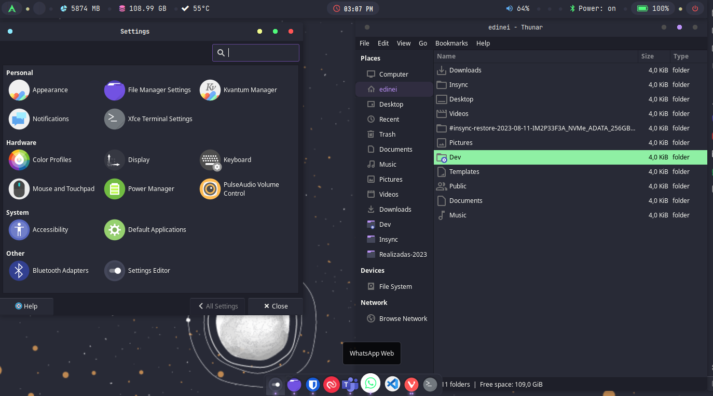

# Archcraft openbox dracula theme

## Screenshot

## Install
- `git clone --recurse-submodules -j8 https://github.com/neiesc/dotfiles.git`
- Run `make`

## Todo
- [ ] Git
- [x] Gitk
- [ ] Gitkraken
- [ ] Rofi
- [x] Openbox
- [x] Openbox icon theme
- [x] GTK
- [x] GTK icon theme
- [x] Xfce4-terminal
- [x] Wallpaper

## Thanks
🙏🏼 [Archcraft](https://github.com/archcraft-os) for the best distro.
 
🙏🏼 [Dracula theme](https://github.com/dracula/dracula-theme) for the best theme.
